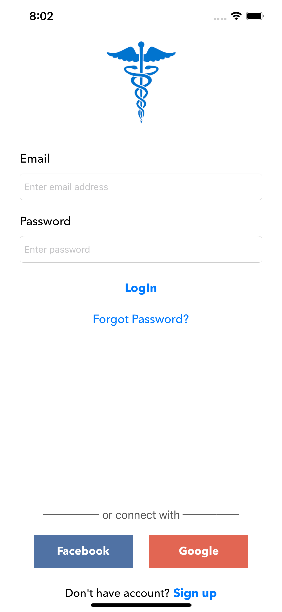
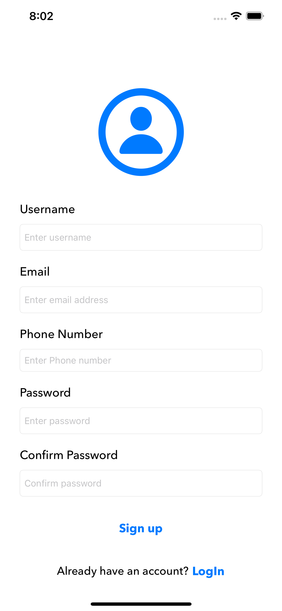
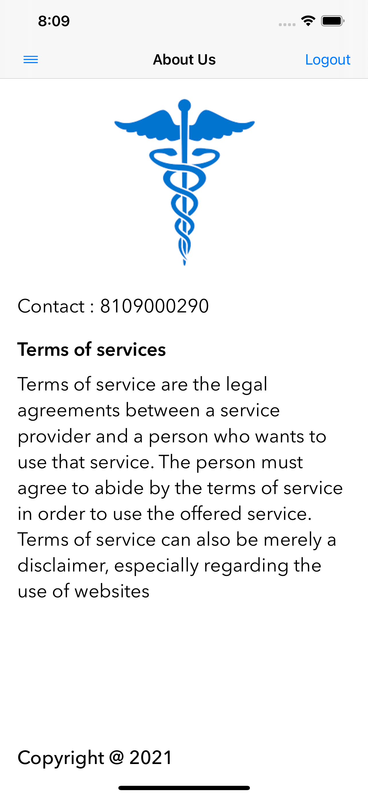

# DemoApp_Test

## Requirements

- Swift 5.0
- Xcode 12 or greater
- iOS 13.0 or greater

## Installation

### CocoaPods
1- FIREBASE
2- IQKeyboardManagerSwift
3- SideMenu
4- SDWebImage

Used this pod for caching the movie poster images

## Usage

### Blogs Data
Used the NewsApi data to get the real time news
API URL: 
https://newsapi.org/v2/top-headlines?country=us&apiKey=cb9ff8ee7a6548ab95003348d2146318

App UI

1- LoginScreen

2- SignUp Screen

3- MainScreen

3- Details

3- AboutUs

## Author
- LinkedIn:[@Dinesh](https://www.linkedin.com/in/idktanwar/)
- Gtihub [@Dinesh](https://github.com/idktanwar/)

## License
@copyright dk@2021
